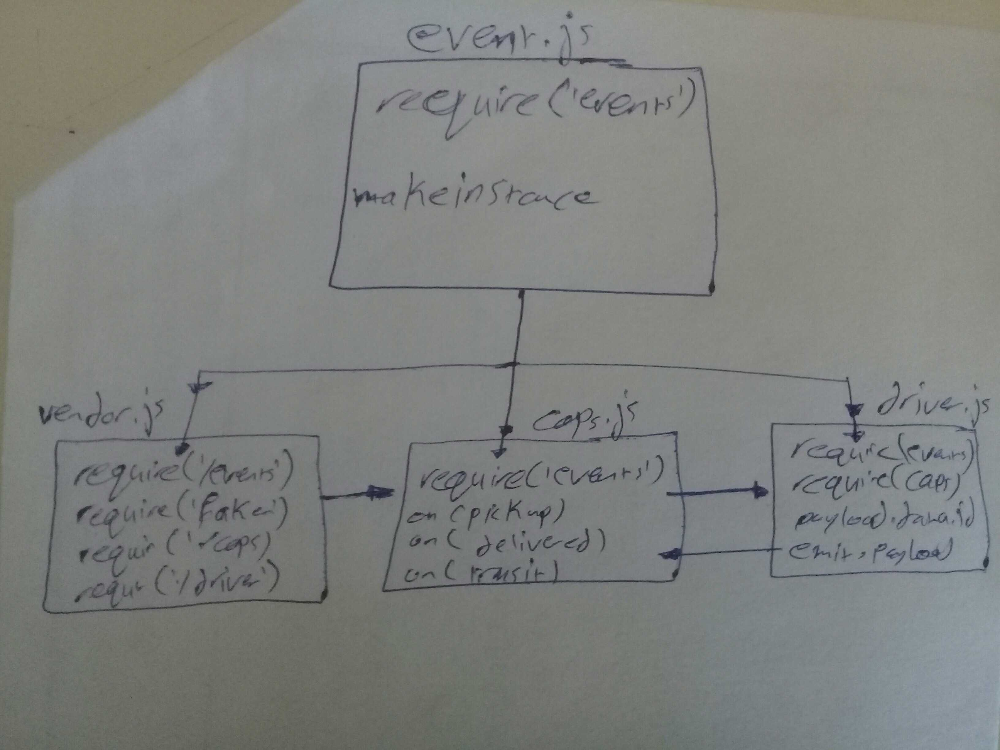

# Project: lab-16

## Author: Hammad Ali

### Setup
**.env requirements (where applicable)
i.e.**

* PORT - 3000

* Store_Name - main-store

### How to initialize/run your application (where applicable)
e.g. nodemon

### How to use your library (where applicable)
Tests

### UML
