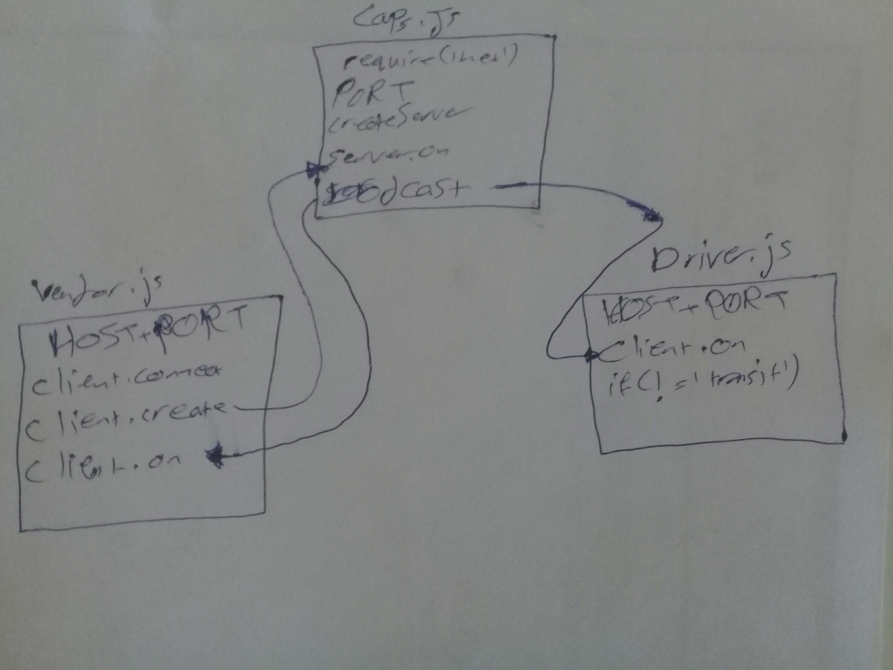

# LAB - 17

## TCP Server 

## Author: Hammad Ali

## Documentation

### Modules

Exported Values and Methods

### Setup

* .env requirements
* PORT=3000

### How to initialize/run your application
npm init -y

### Tests
* Unit Tests: npm test
* Lint Tests: npm run lint

### UML

