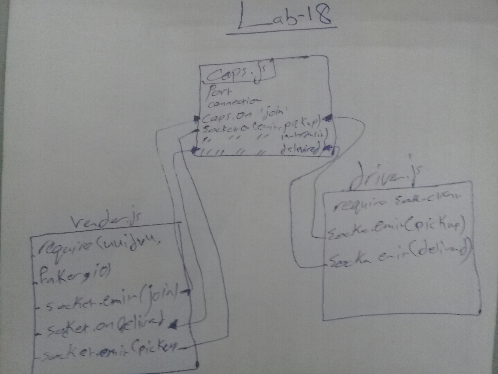

# LAB - 18

## TCP Server / Message Application

## Author: Hammad

## Documentation

### Modules

* Exported Values and Methods

### Setup

**.env requirements**

### How to initialize/run your application

* npm init -y

### How to use your library (where applicable)

### Tests

**Lint Tests: npm run lint**

### UML

